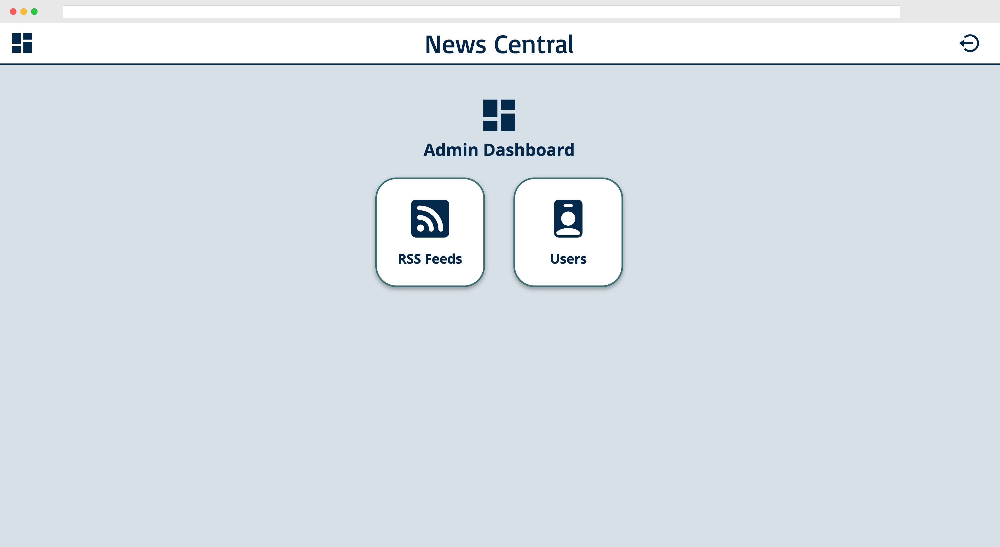

<div align="center">
  <a href="https://github.com/github_username/chess">
    
  </a>

<h3 align="center">News Aggregator</h3>

  <p align="center">
    Fetches news from various sources and displays them in a single webapp.
    <br />
    <a href="#demo">View Demo</a>
    ·
    <a href="https://github.com/AchrafYndz/news-aggregator/issues">Report Bug</a>
    ·
    <a href="https://github.com/AchrafYndz/aggregator/issues">Request Feature</a>
  </p>
</div>

<p align="center">
  
</p>

### Built With

* [Flask](https://flask.palletsprojects.com/en/2.0.x/) 
* [React](https://reactjs.org/) 
* [Vite](https://vitejs.dev/) 
* [Postgres](https://www.postgresql.org/) 
* [Gunicorn](https://gunicorn.org/) 
* [Nginx](https://www.nginx.com/) 


<div style="display: flex; align-items: center;">
  <div style="flex: 1; padding-right: 20px;">
    
### Features

* Fetches articles from various news sources
* Admins can add new sources
* Users can sign up
* Articles get recommended based on user's history
* Users can exclude sources from their feed
* Similar articles are grouped together
* Users have the option to switch sources on an article
* Articles are labeled with tags
* Users can filter by tags
* Users can share an article on social media
* and much more...
  
  </div>
  <div style="flex: 2;">
    
<p align="center">
  
</p>
  
  </div>
</div>


## Getting started

Copy the repository to your local machine, and run the following commands:

### 1. Postgres database, Python interface and dependency manager

```bash
sudo apt install python3 python3-pip nodejs npm libpq-dev python-dev postgresql
sudo pip install python-psycopg2
```

### 2. Create the database

First configure the database with `postgres` user:

```bash
sudo su postgres
psql
```

Then create a role 'app' that will create the database and be used by the application:

```sql
CREATE ROLE app WITH LOGIN CREATEDB;
CREATE DATABASE dbtutor OWNER app;
```

You need to 'trust' the role to be able to login. Add the following line to `/etc/postgresql/9.6/main/pg_hba.conf` (you need root access, version may vary). **It needs to be the first rule (above local all all peer)**.

```
# TYPE  DATABASE        USER            ADDRESS                 METHOD

# app
local   dbtutor         app                                     trust
```

and restart the service. Then initialize the database:

```bash
sudo systemctl restart postgresql
```

### 3. Download Dependencies

We will first install the dependencies for the API:

```bash
virtualenv -p python3 env
source env/bin/activate
pip3 install -r requirements.txt
pip install -e .
```

Then, we will install the dependencies for the webapp:

```bash
yarn
```

### 4. Run development server

```bash
cd src/server
python run.py
```

Then visit http://localhost:8080

### 5. Run the frontend

```bash
cd src/client
yarn start
```

Then visit http://localhost:3000

### Run on GCP using nginx and gunicorn

These steps demonstrate how to run this application with nginx. They are to be executed in addition to the setup in quick start. Instead of running the built in Flask debug server, we use an industrial grade webserver and reverse proxy server: nginx.


#### 1. Install dependencies
```bash
sudo apt install nginx
```


#### 2. Create user to run application
```bash
sudo useradd -m -s /bin/bash app
sudo su - app
```


#### 3. Clone the application in /home/app
```bash
git clone https://github.com/AchrafYndz/News-App
```


#### 4. Follow Quick start to setup the project


#### 5. Test if wsgi entrypoint works
Instead of using the Flask debug server, we use gunicorn to serve the application.
```bash
cd src/server/
gunicorn --bind 0.0.0.0:5000 run:app
```


#### 6. Enable the webservice
As an account with sudo acces (not app), copy the file `service/webapp.service` to `/etc/systemd/system/` and enable the service:

```bash
sudo ln -s /home/app/NewsApp/service/webapp.service /etc/systemd/system/

sudo systemctl enable webapp
sudo systemctl start webapp
```
A file `src/server/webapp.sock` should be created.


#### 7. Build vite app
To build the frontend production use
```bash
yarn run build
```
This will create a directory called dist with and index.html.

```bash
sudo ln -s /home/app/NewsApp/service/webapp.service /etc/systemd/system/

sudo systemctl enable webapp
sudo systemctl start webapp
```
A file `src/server/webapp.sock` should be created.
#### 8. Setup nginx
Link or copy the nginx server block configuration file to the right nginx folders:
```bash
sudo ln -s /home/app/NewsApp/nginx/webapp /etc/nginx/sites-available/
sudo ln -s /home/app/NewsApp/nginx/webapp /etc/nginx/sites-enabled/
```

The contents of this file can be changed for your setup. For example change the IP address to your external IP and add the correct DNS name (`team[x].ua-ppdb.me`)
```
server {
    listen 80;
    server_name <IP> <DNS-NAME>

    location / {
      root   /home/app/News-App/dist;
      index  index.html;
    }

    location /api {
        include proxy_params;
        proxy_pass http://unix:/home/app/News-App/src/server/webapp.sock;
    }

}
```

Test the configuration with `sudo nginx -t`.


#### 9. Restart the server

Restart the server with `sudo systemctl restart nginx`. Your application should be available on port 80.
